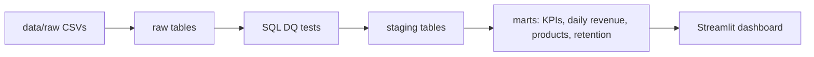

# ShopPulse SQL ETL analytics pipeline

ShopPulse is a local PostgreSQL pipeline for e-commerce CSV snapshots. It ingests customers, orders, and items, validates the raw snapshot, publishes staging and marts SQL, and serves a Streamlit dashboard.

## Run

Requirements: Docker Desktop with Compose. No host PostgreSQL or cloud credentials are required.

```bash
make build
make pipeline
make test
make dashboard
```

Open http://localhost:8501. The database is internal to Compose and is not published to the host. Local credentials are `shoppulse` / `shoppulse_local` for database `shoppulse` on service `db`.

`make pipeline` performs a full snapshot: it validates all CSVs, replaces `raw` in one transaction, runs DQ checks, and publishes staging and marts in a transaction. Re-running it is idempotent. `make ingest` and `make transform` run stages independently; `make down` stops services.

## Data and outputs

Raw fixtures live in `data/raw/{customers,orders,items}.csv`; `data/bad` is a deliberately invalid demo. Outputs are `staging.customers`, `staging.orders`, `staging.items`, and marts for KPIs, daily revenue, top products, and cohort retention. The sample KPIs are revenue `$127.00`, 6 completed orders, 3 purchasing customers, `$21.17` AOV, 2 repeat customers, and 12 units.

Revenue excludes pending/cancelled orders; tax, shipping, refunds, and currency conversion are outside this MVP. Cohorts use the first completed purchase month. The dashboard displays six KPIs plus daily revenue and top-product charts.



## Quality and bad-data demo

```bash
make demo-bad       # loads data/bad
make test-data      # exits non-zero and reports DQ violations
make pipeline       # restores the valid snapshot
```

Checks cover not-null fields, unique order IDs, non-negative revenue, referential integrity, valid statuses, and source row counts. Published marts remain available while an invalid raw snapshot is rejected by transform.

## Add a model

Add a numbered SQL file under `sql/models/` so lexicographic execution places dependencies first. Build from `staging` or existing marts, expose the result in `dashboard/app.py` if user-facing, and add a focused integration assertion in `tests/test_pipeline.py`. Keep publication inside the transform transaction.

## Development

The CLI is `python -m shoppulse {ingest,transform,test-data,run}` and reads `DATABASE_URL`. A scheduler can invoke `make pipeline` from cron. `pytest` runs unit tests everywhere and PostgreSQL integration tests when `DATABASE_URL` is set.
